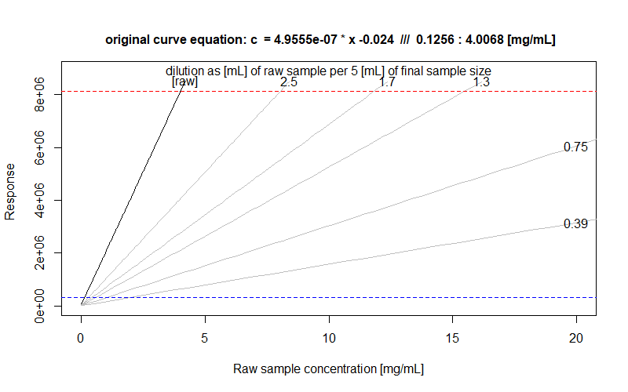

# sample_dilution_assistant

This is a simple R script intended to ease some laboratory work during (especially) quantitative analyses utilizing any linear calibration curve.
  
The idea is to plot a visual guide helping to estimate a proper sample dilution to make the result fit within a known calibration curve.  

The plot shows `response` as a function of `concentration`, which is of course the reversal of how a curve should be normally used. The original (yet inverted) calibration curve is plotted in black and labelled as `[raw]`. "Diluted" curves, plotted in grey, show the expected response if a given aliquot (grey curve's label) were diluted to a chosen volume (see in-plot description over the curve labels).  
This allows to visually check whether a given concentration should fall within the curve range (i.e. between horizontal dashed lines) or above it, and to decide on a satisfying dilution without making any calculations.

  
#### Why?
Because we are lazy and forgetful.  
Because we have misestimated our dilutions at least one too many times.  

#### When?
When you know the approximate concentration of your sample and you are certain that it falls way beyond your fancy calibration curve. Especially useful if this scenario happens on a daily basis.  

#### How?

Get `sample_dilution_assistant.R` and source it.  
Get `sda_caller.R` and see how it works.  

#### To run this script you must know:
* your linear calibration curve ~~equation~~ coefficients (slope `a` and intersection `b`)
* the boundaries of your curve, expressed as a minimal and maximal response (`minresp`, `maxresp`) OR as minimal and maximal concentration (`minc`, `maxc`)  
  
Further parameters are not explicit (have defaults), yet very useful in trimming the result to your needs.
  
#### By default:
* analyte unit is set to mg
* sample unit is set mL
* maximal raw sample concentration (thus x-axis range) is set to 200 mg/mL
* target dilution unit and size are set to 5 mL
* 5 evenly-distributed sample aliquots are proposed

### Important notices:
* The script accepts lowercase `l` or uppercase `L` as litre-sign; for the sake of clarity, an uppercase `L` was used in default settings.
* By now, the curve volume unit (denominator) is thought to be the same as the target dilution unit.
* The script handles mg and µl (or µL) as sample measurement unit and mg, µL, g and mL as target dilution unit.
* The script neglects densities and simply assumes that 1 mL of your sample is equal to 1 g. This is important mostly in case of *weighing* an aliquot to be later diluted to a given *volume*, yet the difference should never ruin your day if you simply aim for a mid-range dilution.

